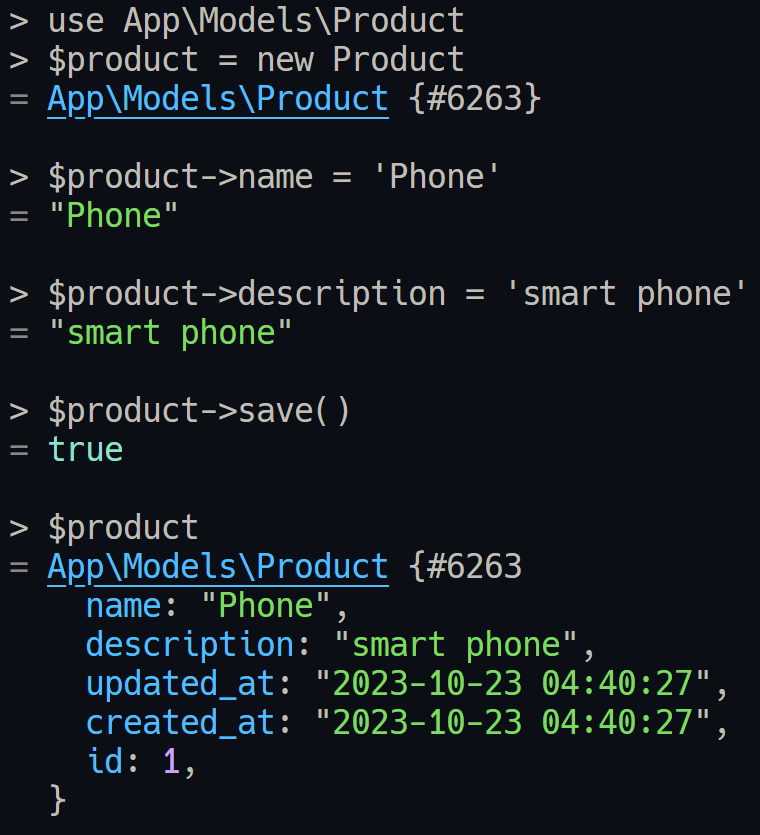

# CRUD whit Laravel

### Description

This project is a CURD practice make with Laravel 10 and some aditional technologies as:

* Elocuent
* MySQL

### Notes

#### Migrations

rollback: rever last migration batch

```
php artisan migrate:rollback
sail artisan migrate:rollback
```

fresh (WARN): delete all tables and run all migrations. Warning this is a destructive method.

```
php artisan migrate:fresh
sail artisan migrate:fresh
```

refresh (WARN): execute down method of all migrations and then run all migrations. Warning this is a destructive method.

```
php artisan migrate:refresh
sail artisan migrate:refresh
```

add new camp to a table

```bash
sail artisan make:migration	 add_{camp_name}_to_{table_name}_table
```

Modify camp in a table

```bash
php artisan make:migration modify_name_in_products_table
```

---

* [ ] Tinker: interact with your project using console



Seeder

`php artisan make:seeder ModelSeeder`
